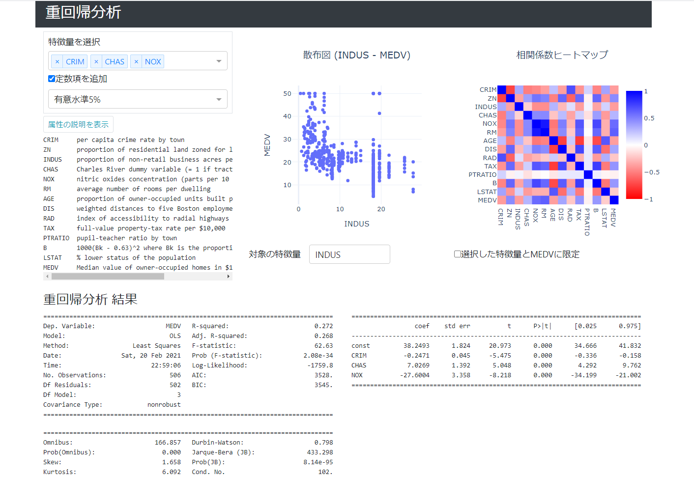

# multiple_regression

* scipyを使って重回帰分析を実行するデモアプリ
* データは[The Boston house-price](http://lib.stat.cmu.edu/datasets/boston)のデータセットを使用する
  * scikit-learnが提供しているメソッド経由で入手する



## 使用パッケージ

各Pythonパッケージのバージョンについては、[リポジトリ直下のrequirements.txt](../requirements.txt)を参照する。

* Python3.9
  * Dash
  * Dash Bootstrap Components
  * Plotly
  * Pandas
  * StatsModels

## 使い方

* 各Pythonパッケージのインストール

  [リポジトリ直下のREADME.md](../README.md)のセットアップに従って、パッケージをインストールする。

* ディレクトリの移動

  ```
  cd two_sample_t_test
  ```

* アプリの起動及びアクセス

  ```
  python app.py
  ```

  そのあと、http://127.0.0.1:8050/ にアクセスする。
