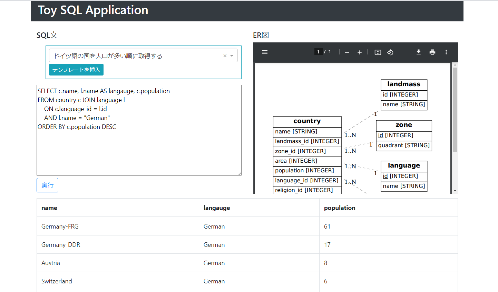
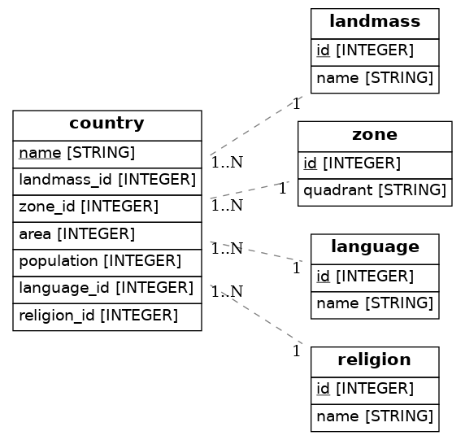

# toy_sql

* SQLクエリ文を実行して、結果を出力するデモアプリ
* SQLiteのDBを'./data'にデプロイして使用する
* [UCI ML RepositoryのFlags Data Set](https://archive.ics.uci.edu/ml/datasets/Flags)のデータをもとにDBを作成する
  * 1986年における各国の言語、地域、宗教、国旗のデータセット



## 使用パッケージ

各Pythonパッケージのバージョンについては、[リポジトリ直下のrequirements.txt](../requirements.txt)を参照する。

* Python3.9
  * Dash
  * Dash Bootstrap Components
  * Pandas
  * SQLAlchemy

## 使い方

* 各Pythonパッケージのインストール

  [リポジトリ直下のREADME.md](../README.md)のセットアップに従って、パッケージをインストールする。

* ディレクトリの移動及びDBのデプロイ

  ```
  cd toy_sql
  python deploy_db.py
  ```
  実行後、`./data`に`flags.csv`と`db.sqlite`が生成される
  * `flags.csv`は、レポジトリから取得したcsvファイル
  * `db.sqlite`は、デプロイしたDBファイル

* アプリの実行及びアクセス

  ```
  python app.py
  ```

  実行後、http://127.0.0.1:8050/ にアクセスする。

## データについて

* [レポジトリ](https://archive.ics.uci.edu/ml/datasets/Flags)から取得したcsvを複数のテーブルに分割してデプロイする

  ### ER図

  

  ### 各テーブルの属性の意味

  idは意味が自明なので、省略して記載する。

  * country
    * name : 国名。
    * area : 面積。単位は1,000km^2。
    * population : 人口。単位は1,000,000人。
  * landmass
    * name : 国が属している六大州。
  * zone
    * quadrant : 国の位置の象限。本初子午線と赤道に基づく。
      * 例 : NW → North Westの略で、北アメリカ大陸が位置する象限。
  * language
    * name : 国で話されている主要な言語名。
  * religion
    * name : 国の主要な宗教名。


## ER図の生成に関して

  [ERAlchemy](https://github.com/Alexis-benoist/eralchemy)を使用して、`./erd.pdf`からER図を生成する。手順は次の通り。

  * Graphvizのインストール

    ```
    sudo apt install graphviz
    ```
    
  * ERAlchemyのインストール

    ```
    pip install ERAlchemy==1.2.10
    ```

  * ER図の生成

    ```
    eralchemy -i toy_sql/erd.er -o toy_sql/assets/erd.pdf
    ```