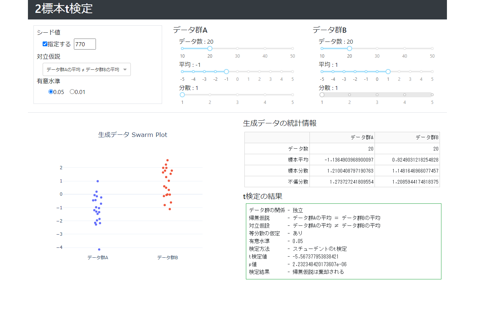

# two_sample_t_test

* 2標本t検定を実行するデモアプリ
* データは正規分布に従って生成させる
* インタラクティブに設定を変更し、直ちに結果を出力する



## 使用パッケージ

各Pythonパッケージのバージョンについては、[リポジトリ直下のrequirements.txt](../requirements.txt)を参照する。

* Python3.9
  * Dash
  * Dash Bootstrap Components
  * Plotly
  * NumPy
  * SciPy

## 使い方

* 各Pythonパッケージのインストール

  [リポジトリ直下のREADME.md](../README.md)のセットアップに従って、パッケージをインストールする。

* ディレクトリの移動及びアプリの実行

  ```
  cd two_sample_t_test
  python app.py
  ```

* アプリへのアクセス

  http://127.0.0.1:8050/ にアクセスする。
